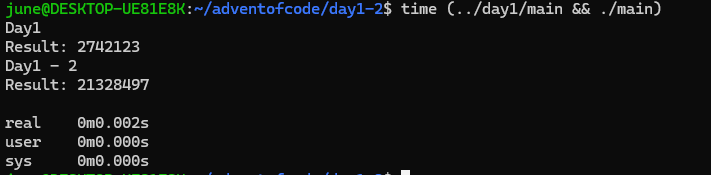
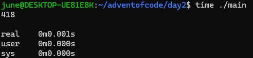

# Advent of Code

Alex Xu suggested I try this for fun and to see how closely it resembles real job challenges, so I decided to do everything in C. I'll try to complete each challenge before I go to sleep since I'm bored as a FAANG engineer.

## Day 1

- Just reading a file, sorting it, and calculating the result. I didn't want to rewrite quicksort, so I used stdlib instead.
- Rewriting a hashmap in C was quite an experience, though!

**Result**:

## Day 2

- Basic list operations.
- I couldn't get an O(N) solution to work, so I went with an O(N^2) approach. I think the issue lies with edge cases at the boundaries, but whatever.

**Result**:

## Day 3

- Used memmove along with some pointer logic.
- Forgot that you need one extra byte when moving within the same pointer range—lesson learned!
