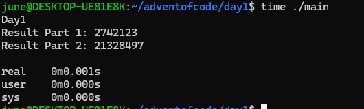

# Advent of code

Alex Xu told me to do this for fun and see how closely it is to real job so I did all in C. I will try to do them before I sleep as I am bored FANNG engineer.

## Day 1

- Just reading a file, sorting it, and calculating the value. I didn't want to re-write quick sort so I did use stdlib.
- Re-writing a hashmap in C is somethign tho lol..

**Result**:

## Day 2

- List stuff.
- I can't seem to get O(N) solution to work so I did N^2. I think it has to do with the edge cases at the ends but whatever

**Result**:

